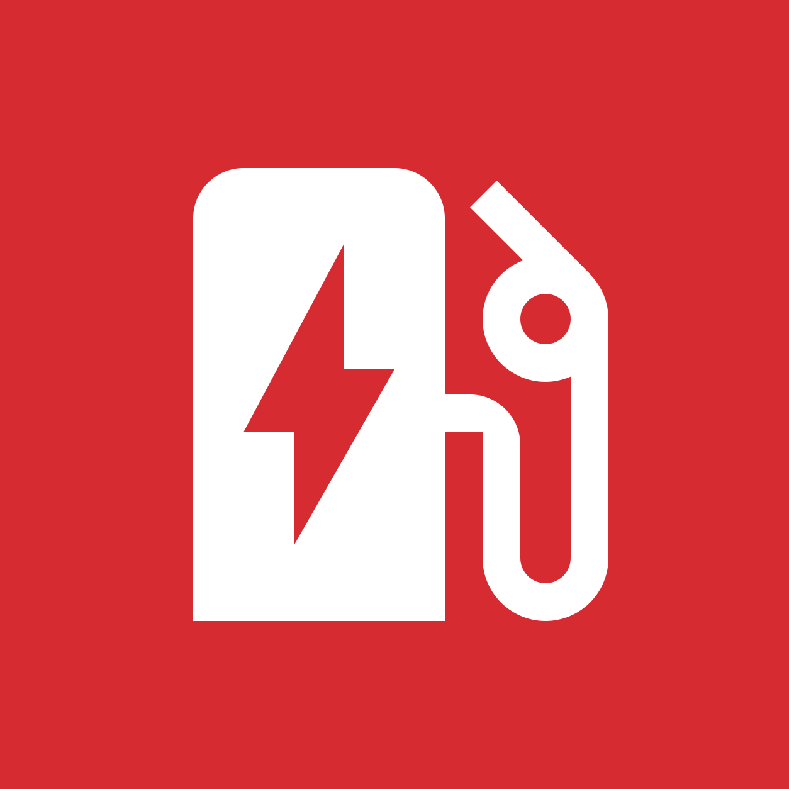
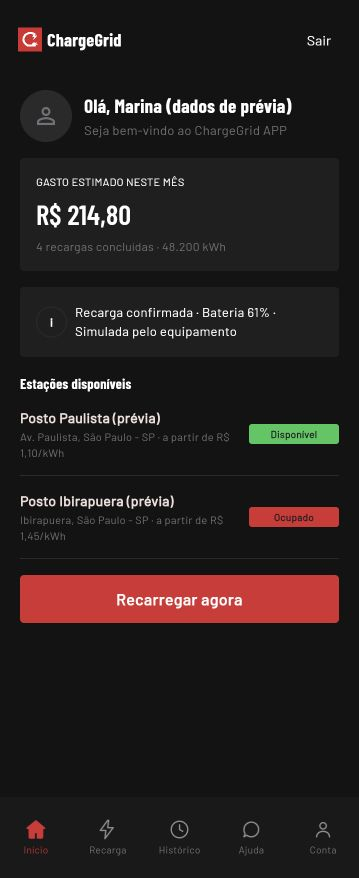
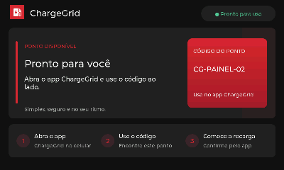
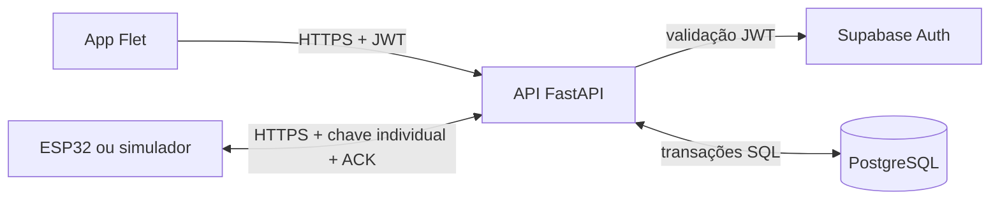
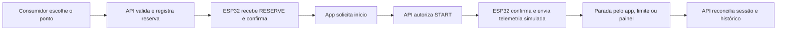

<div align="center">



# ChargeGrid

**Encontre um ponto. Reserve. Acompanhe a recarga.**

Protótipo acadêmico da equipe **FFIVE** que integra aplicativo, API e painel ESP32 para demonstrar a gestão de eletropostos.

`Flet` · `FastAPI` · `PostgreSQL` · `ESP32-S3` · `LVGL`

[Como executar](#como-executar) · [Arquitetura](#arquitetura-e-fluxo) · [Resultados](#resultados-observados) · [Documentação técnica](#documentação-e-código)

</div>

> **Escopo da bancada:** reservas, comandos e histórico passam pelo sistema integrado. Potência, energia e SoC são gerados por `SimulatedSensors`. O protótipo não mede um veículo, não aciona um carregador e não processa pagamentos.

## Visão do projeto e versões

O ChargeGrid foi pensado para facilitar ao consumidor a busca e o acompanhamento de recargas e ao vendedor a gestão de postos e tarifas. A mesma conta pode acessar funções de consumo e, após vincular um equipamento próprio, funções de operação. A proposta busca apoiar a expansão da infraestrutura para veículos elétricos; a integração com recarga elétrica real ainda está fora do escopo deste protótipo.

Este `main` documenta a fundação integrada com app, API e painel físico. A branch **[`Simulado`](https://github.com/DJLIMA1/FIAP-ChargeGridApp-GS1-2026/tree/Simulado)** mantém a versão anterior executável localmente, com dados em JSON e README próprio, para preservar essa base e experimentar outras ideias. Consulte essa branch para as instruções específicas da versão simulada.

## O que foi construído

| Componente | Função | Código |
| --- | --- | --- |
| Aplicativo | Cadastro/login, busca de postos, reserva, recarga, histórico e gestão pelo vendedor | [`apps/mobile/`](apps/mobile/) |
| API | Autenticação, autorização, regras de reserva/recarga e comandos para dispositivos | [`apps/api/`](apps/api/) |
| Banco | Perfis, postos, pontos, reservas, sessões, dispositivos, comandos e telemetria | [`apps/api/migrations/`](apps/api/migrations/) |
| Painel ESP32 | Interface touch, sincronização HTTPS, confirmação de comandos e parada local | [`firmware/esp32/`](firmware/esp32/) |
| Simulador e ferramentas | Dispositivo simulado, provisionamento, QA e manutenção | [`tools/`](tools/) |

O vendedor vincula o equipamento por um **QR privado de propriedade**, configura localização, conector e tarifa e publica o ponto. O consumidor usa um **código público diferente** para iniciar a recarga. O sistema só considera uma ação aplicada depois da confirmação do dispositivo.

## Protótipo visual

<table>
  <tr>
    <th>Prévia da interface do aplicativo</th>
    <th>Framebuffer capturado do painel físico</th>
  </tr>
  <tr>
    <td align="center"></td>
    <td align="center"></td>
  </tr>
</table>

A imagem do app é uma **prévia com dados fictícios**. A imagem do painel foi lida do framebuffer da placa conectada na versão 0.3.4; não é fotografia do LCD e não contém QR ou credenciais privadas. Mais detalhes em [painel Waveshare](docs/waveshare-panel.md).

## Arquitetura e fluxo





A API é a única camada que acessa o banco e aplica as permissões. O ESP32 sincroniza a cada **5 s durante a recarga** e **10 s fora dela**. Se ficar **45 s sem comunicação**, a bancada encerra a sessão localmente; após reinício, uma sessão nunca recomeça sem nova autorização. [Diagramas detalhados, circuito funcional e decisões técnicas →](docs/integracao-componentes.md)

## Resultados observados

Os ensaios de integração registrados em 21/09/2026 cobriram autenticação, reserva, ACK do dispositivo, início, telemetria, parada, histórico, isolamento entre contas e limite automático de custo. Os três exemplos abaixo foram executados na **placa física**, com medições **simuladas**:

| Ensaio | Energia simulada | Custo estimado | Resultado |
| --- | ---: | ---: | --- |
| Parada solicitada pelo app | 60,392 Wh | R$ 0,0906 | `completed` |
| Parada local no dispositivo | 12,084 Wh | R$ 0,0181 | `completed` |
| Teto de R$ 0,01 | 6,666 Wh | R$ 0,0100 | `cost_limit` |

Os valores mostram o funcionamento do **modelo de controle**, não energia entregue a um carro. Evidências: [validação integrada](docs/validacao-mvp-0.2.0.md), [resultados estruturados](docs/qa-live-results.json), [primeira vinculação física](docs/validacao-0.3.2.md) e [histórico do painel](docs/waveshare-panel.md). O fluxo de restauração pelo app ainda não foi repetido fisicamente após a correção da permissão SQL, conforme o histórico do painel.

## Como executar

Requisitos: **Python 3.12** para o app, **Python 3.11** para a API e **PlatformIO** para o firmware. Copie [`.env.example`](.env.example) para `.env` na raiz e preencha os valores locais. O `.env` está ignorado pelo Git.

**Aplicativo**, na raiz do repositório:

```bash
python3.12 -m venv .venv
source .venv/bin/activate
pip install -r requirements.txt
python src/main.py
```

**API**, em outro terminal e com o banco configurado:

```bash
cd apps/api
python3.11 -m venv .venv
source .venv/bin/activate
pip install -r requirements.txt
alembic upgrade head
uvicorn app.main:app --reload
```

Antes de executar a API com o papel de banco restrito, aplique também a concessão descrita em [instalação e configuração](docs/setup.md#api-e-postgresql). Para compilar a interface da placa:

```bash
pio run -d firmware/esp32 -e waveshare_panel_ui
```

Para demonstrar sem a placa, use o [simulador de dispositivo](docs/demo.md) com uma identidade provisionada. O [guia completo](docs/setup.md) explica banco, Auth, provisionamento por QR, APK e implantação; o [roteiro de apresentação](docs/demo.md) percorre a operação de ponta a ponta.

## Justificativa técnica e ligação com a disciplina

| Conteúdo aplicado | Onde aparece |
| --- | --- |
| Sistemas embarcados e IoT | ESP32-S3, touch, Wi-Fi, estados locais e watchdog |
| Redes e protocolos | HTTPS/JSON, sincronização periódica, comandos versionados e ACK |
| Banco de dados | Modelos relacionais, migrações e transações para reservas concorrentes |
| Segurança | JWT, propriedade do equipamento, chaves separadas e TLS |
| Engenharia de software | App, API e firmware em camadas, testes e contratos documentados |

As escolhas, consequências e o **diagrama do circuito funcional da bancada** estão em [integração dos componentes](docs/integracao-componentes.md). Como o LCD e o touch são integrados à placa comercial e não há circuito externo de potência, o diagrama descreve essas conexões sem inventar pinagem, relé ou sensores que não existem no protótipo.

## Documentação e código

| Tema | Link |
| --- | --- |
| Integração, fluxogramas, circuito e resultados | [Integração dos componentes](docs/integracao-componentes.md) |
| Arquitetura e segurança | [Arquitetura](docs/architecture.md) |
| Endpoints HTTP | [Contrato da API](docs/api.md) |
| Comandos e telemetria | [Protocolo ESP32](docs/esp32-protocol.md) |
| Instalação e provisionamento | [Guia de configuração](docs/setup.md) |
| Firmware e painel | [README do firmware](firmware/esp32/README.md) · [Validação do painel](docs/waveshare-panel.md) |
| Demonstração | [Roteiro](docs/demo.md) |

## Limites do MVP

O painel não controla energia nem mede um veículo; os custos são estimativas. O pagamento é demonstrativo. Confirmação de e-mail está desativada neste ambiente e a recuperação depende de SMTP próprio. APKs, firmware compilado, chaves de dispositivo, QR privado e `.env` ficam fora do repositório; os guias ensinam a gerar os artefatos. Dados e imagens publicados aqui não expõem credenciais de provisionamento.

## Equipe FFIVE

| Integrante | RM |
| --- | ---: |
| Augusto de Souza Ávila | 570839 |
| Davi Simoncelo | 571738 |
| João Pedro Sousa | 573962 |
| Matheus Evangelista Silva | 568593 |
| Murilo Lima de Carvalho | 570156 |
