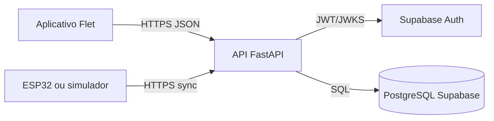

# Arquitetura

O aplicativo autentica a pessoa no Supabase Auth e envia o access token para a API em `Authorization: Bearer`. A API valida assinatura, emissor, público e expiração do JWT com as chaves públicas do projeto. Ela aceita chaves ES256 e RS256 porque essa é a lista explícita de algoritmos configurada na validação; não aceita algoritmos enviados pelo token.

O PostgreSQL guarda perfis, postos, pontos, reservas, sessões, dispositivos, comandos e telemetria. O app nunca acessa tabelas diretamente. Reservar, iniciar, parar ou alterar um posto passa pela API, que identifica o usuário pelo token e aplica as regras numa transação.

Cada ESP32 tem uma chave aleatória própria. O equipamento envia `Authorization: Device <chave>` ao sincronizar; a API armazena somente o hash, vincula a chave a um único ponto e pode revogá-la. O dispositivo recebe comandos pendentes na resposta e confirma a aplicação no próximo `sync`.

## Papéis e operação

Uma pessoa pode usar a área de consumidor e operar os próprios postos. A tela não concede esse papel: `operator_enabled` é uma decisão administrativa no perfil. Para o piloto, a aprovação de operador é manual: o responsável registra ou habilita o perfil no banco pelo acesso administrativo e então permite que ela cadastre seus postos. Não exponha uma rota pública para promover operadores.

As migrações usam `MIGRATION_DATABASE_URL` quando presente. Elas criam o papel sem login `chargegrid_api`, concedem a ele apenas o acesso necessário, habilitam RLS nas tabelas do domínio e aplicam a política de execução para esse papel. Depois da migração, o administrador executa `apps/api/sql/grant_runtime_role.sql` para conceder `chargegrid_api` ao login usado em `DATABASE_URL`; esse login não é dono das tabelas e não pode ter `BYPASSRLS`. Migração e operação não usam a mesma credencial.

## Supabase e limites de acesso

Desative a Data API do Supabase para este projeto. A migração revoga privilégios de `anon` e `authenticated` nas tabelas de negócio; os clientes usam apenas Auth e a API e não recebem uma chave de serviço. Se a Data API for reativada no futuro, RLS não substitui a autorização da API.

O projeto atual desativa a confirmação de e-mail porque o SMTP padrão do Supabase só atende membros da equipe e limita o projeto a duas mensagens por hora. Senha, JWT, limites e autorização da API continuam obrigatórios, mas a posse do e-mail não é verificada. Para sair do MVP, configure SMTP próprio ou OAuth, reative a confirmação e valide recuperação. A API não registra senha, código OTP, token nem chave de dispositivo.

## Implantação

A API é implantada na Vercel com a raiz do projeto configurada como `apps/api`. O arquivo `apps/api/vercel.json` encaminha as requisições para `app/main.py`. Defina as variáveis de ambiente no projeto da Vercel; não envie `.env` ao repositório. O banco usa a conexão de pooler do Supabase em modo transação, sem pool local grande e com prepared statements desabilitados. Para migrar, use uma conexão administrativa separada fora da função serverless.
