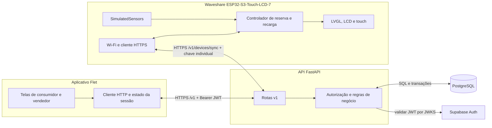
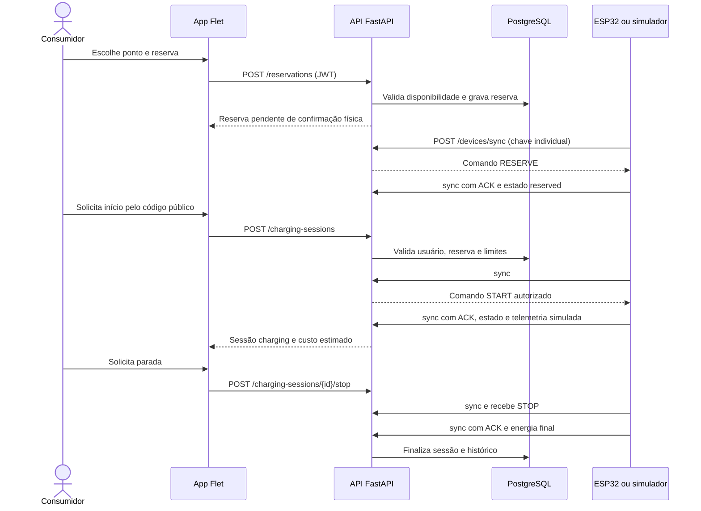
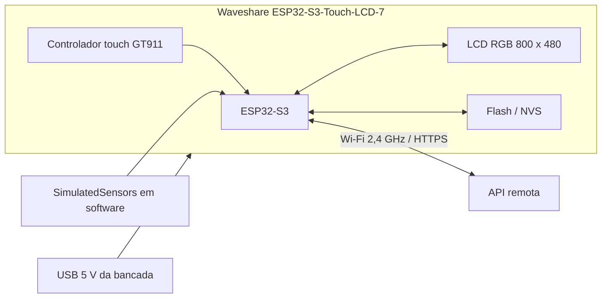

# Integração dos componentes e circuito funcional

Este documento descreve o protótipo acadêmico implementado no repositório. A lógica de reserva e recarga usa API e dispositivo reais; os valores de potência, energia e SoC da bancada vêm de `SimulatedSensors`. A placa **não está ligada à rede elétrica de um carregador nem a um veículo**.

## Diagrama de blocos

O app não acessa o banco diretamente. A API valida identidade e propriedade, mantém comandos e histórico e reconcilia o estado comunicado pelo dispositivo. A resposta de `sync` entrega comandos ao ESP32; o próximo `sync` traz a confirmação de aplicação. Consulte [arquitetura](architecture.md), [contrato HTTP](api.md) e [protocolo do dispositivo](esp32-protocol.md).

## Fluxo de uma recarga

`START` só pode ser emitido pela API. O ESP32 aceita parada local pelo touch ou `CG_STOP`, mas não início local. Em recarga, a sincronização ocorre a cada 5 segundos; fora dela, a cada 10 segundos. Falta de comunicação por 45 segundos aciona a parada local. O dispositivo nunca retoma uma sessão automaticamente após reiniciar. Uma reserva ainda válida pode ser restaurada sem prorrogar o prazo original.

## Circuito da bancada e limites físicos

É um **diagrama de conexão funcional** dos elementos integrados à placa comercial, e não um esquema de pinagem ou de potência. O protótipo usa a alimentação USB da placa, LCD e touch integrados, Wi-Fi do ESP32-S3 e memória NVS. Não há sensor elétrico externo, relé, contator, medidor de energia, cabo de carga ou circuito de acionamento de veículo. Por isso não há GPIO externo ou valor de componente discreto a declarar. O perfil de hardware e as dependências de compilação estão em [`firmware/esp32/platformio.ini`](../firmware/esp32/platformio.ini); a integração do painel está em [`panel_hardware_waveshare7.cpp`](../firmware/esp32/src/panel_hardware_waveshare7.cpp).

## Escolhas técnicas

| Escolha | Motivo e consequência no protótipo |
| --- | --- |
| Flet no app | Permite desenvolver as telas e regras de interação em Python para o MVP; toda operação sensível continua passando pela API. |
| FastAPI como única camada de negócio | Centraliza autorização, concorrência de reservas, comandos, idempotência e histórico. |
| PostgreSQL com transações | Mantém reserva, sessão e comandos consistentes diante de chamadas simultâneas ou repetidas. |
| Supabase Auth + JWT verificado pela API | Separa autenticação de usuário da autorização sobre postos e recargas. |
| Chave individual no ESP32 + QR de propriedade separado | A credencial de comunicação não concede propriedade; o QR privado vincula o equipamento ao vendedor. |
| HTTPS com validação TLS | Protege as requisições do app e o `sync` da placa. |
| Comandos com ACK e versão | Evita tratar um pedido HTTP como confirmação física; permite reconciliação após atraso, repetição ou reinício. |
| `SimulatedSensors` | Permite exercitar fluxo, interface e limites sem afirmar medição elétrica real. |
| LVGL no painel | Exibe disponibilidade, reserva, sessão e parada no touch integrado. |

## Evidências funcionais

Os registros estruturados em [`qa-live-results.json`](qa-live-results.json) documentam testes de login, vínculo, reserva, comando confirmado pelo dispositivo, telemetria, parada, histórico e autorização entre contas. A validação física de 21/09/2026 registrou:

| Ensaio na placa | Energia simulada | Custo estimado | Resultado |
| --- | ---: | ---: | --- |
| Início e parada pelo app | 60,392 Wh | R$ 0,0906 | Sessão `completed`, motivo `requested` |
| Início pelo app e parada local | 12,084 Wh | R$ 0,0181 | Sessão `completed`, motivo `requested` |
| Limite automático de R$ 0,01 | 6,666 Wh | R$ 0,0100 | Encerramento `cost_limit` |

Esses valores demonstram cálculo e controle do **modelo simulado**, não consumo de um veículo. Ver [validação integrada](validacao-mvp-0.2.0.md), [validação de ownership](validacao-ownership-0.3.0.md), [painel físico](waveshare-panel.md) e [validação 0.3.2](validacao-0.3.2.md). A restauração pelo botão do app foi implementada e testada em software; a documentação do painel registra que ela ainda não foi repetida fisicamente após a correção da permissão SQL.

## Relação com os conteúdos da disciplina

O projeto aplica conceitos de **sistemas embarcados e IoT** (ESP32, interface local, Wi-Fi, estado físico e watchdog), **redes e protocolos** (HTTPS, JSON, sincronização periódica e confirmação de comandos), **engenharia de software** (separação de camadas, contratos, testes e documentação), **bancos de dados** (modelagem, migrações e transações) e **segurança** (JWT, autorização por proprietário, credenciais separadas e TLS). A demonstração também aborda a distinção experimental entre uma telemetria simulada e uma medição física, condição necessária para interpretar corretamente os resultados.

## Onde encontrar e reproduzir

| Item | Local |
| --- | --- |
| App e telas | [`apps/mobile/`](../apps/mobile/) |
| API, modelos, migrações e testes | [`apps/api/`](../apps/api/) |
| Firmware e configuração do painel | [`firmware/esp32/`](../firmware/esp32/) |
| Simulador e ferramentas de QA | [`tools/`](../tools/) |
| Instalação e provisionamento | [Guia de configuração](setup.md) |
| Apresentação passo a passo | [Roteiro de demonstração](demo.md) |

Para gerar as telas simuladas pelo firmware e testar o controlador no host, execute `python tools/validate_firmware.py` após instalar as dependências descritas no [guia do painel](waveshare-panel.md). Para compilar o hardware, use `pio run -d firmware/esp32 -e waveshare_panel_ui`. A captura pública do framebuffer em [`images/painel-esp32-framebuffer.png`](images/painel-esp32-framebuffer.png) veio da placa física e não contém QR privado.
