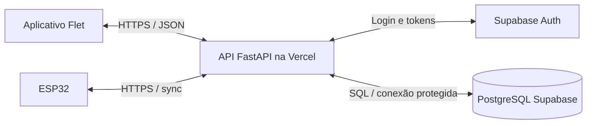

# ChargeGrid — planejamento do MVP conectado

Data: 18/09/2026. Status: plano histórico aprovado. O onboarding manual de operadores e a criação manual de pontos descritos neste plano foram substituídos em 21/09/2026 por propriedade via QR de fábrica; o contrato vigente está em [api.md](api.md) e [setup.md](setup.md).

## 1. Objetivo e limites

Transformar o protótipo Flet em uma demonstração funcional de produto: duas contas compartilham os mesmos postos, uma pessoa reserva um ponto, o ESP32 confirma a reserva, recebe autorização para iniciar e envia o progresso da recarga ao aplicativo.

O código deve ser adequado a uma equipe de Ciência da Computação no segundo semestre: módulos pequenos, nomes claros, bibliotecas conhecidas, comentários curtos para decisões importantes e documentação de instalação separada do código. A simplicidade não deve eliminar autenticação, autorização ou proteção contra reservas concorrentes.

Premissas para a primeira entrega:

- Aplicativo Flet existente preservado; demonstração inicialmente no desktop, com organização compatível com futura compilação mobile.
- Um servidor HTTP, um banco PostgreSQL e um serviço de autenticação gerenciado.
- Um ESP32 por ponto de recarga; um posto pode ter vários pontos.
- Reserva imediata com prazo de chegada de 10 minutos. Agendamento por calendário fica para outra versão.
- Um usuário pode ter uma reserva pendente/confirmada ou uma recarga em andamento por vez; a reserva é consumida ao iniciar a sessão.
- Placa e sensores ainda não informados: firmware terá uma fonte simulada de medições e uma interface para conectar sensores depois. A simulação será identificada no app.
- Pagamentos continuam demonstrativos. Nenhuma cobrança real, chave Pix pessoal ou dado bancário será necessário.
- Contas de operador aprovadas manualmente para o piloto; uma conta pode consumir e operar seus próprios postos.

## 2. O que existe e precisa mudar

Leitura realizada em `src/main.py`, `src/data_manager.py`, `src/theme.py`, `README.md` e `requirements.txt`.

| Situação atual | Mudança planejada |
| --- | --- |
| `main.py` com 2.744 linhas, misturando telas, autenticação, mapas e recarga | Extrair telas por funcionalidade e criar um cliente HTTP único |
| `DataManager` grava todas as contas e dados em `ev_data.json` | Dados compartilhados passam para PostgreSQL, acessados exclusivamente pela API |
| Senha em texto puro e recuperação apenas informando o e-mail | Supabase Auth, confirmação de identidade e recuperação com código de uso único |
| Sessão local baseada em e-mail salvo | Sessão autenticada com tokens; nenhum login automático baseado em JSON |
| Disponibilidade calculada por `busy_until` local | Disponibilidade calculada com reserva, sessão, conectividade e estado confirmado pelo dispositivo |
| Recarga e energia calculadas por temporizador do app | ESP32 informa medições; servidor registra a sessão; app apresenta o resultado |
| Postos encontrados por nome e proprietário | IDs estáveis para postos, pontos, sessões e dispositivos |
| Alternativa HTTPS desativa validação de certificado | Remover essa alternativa; falhar com mensagem clara e instrução de corrigir certificados |
| Busca Bluetooth e Pix simulados | Identificação do ponto por código/QR e etapa claramente intitulada demonstração |
| Conta do vendedor e chatbot contêm informações fixas | Remover afirmações fictícias; manter ajuda simples e dados reais disponíveis pela API |

O tema, os componentes visuais, ícones e o trabalho de mapas serão reaproveitados. A reorganização será gradual, com execução do app verificada após cada etapa.

## 3. Arquitetura escolhida



A API é a autoridade sobre quem pode reservar, iniciar, interromper e consultar cada recarga. O ESP32 é a origem do estado observado no equipamento. O app não altera tabelas diretamente nem determina sozinho que uma operação física aconteceu.

| Componente | Escolha | Motivo |
| --- | --- | --- |
| Interface | Python + Flet + Pillow existentes | Preserva o trabalho da equipe |
| Cliente HTTP | HTTPX assíncrono | Evita travar a interface durante as chamadas |
| Servidor | Python + FastAPI + Pydantic | Mantém Python; valida entradas e gera OpenAPI |
| Banco | PostgreSQL no Supabase | Relações, transações e hospedagem gerenciada |
| Persistência do servidor | SQLAlchemy + Psycopg | Consultas parametrizadas e transações explícitas |
| Migrações | Alembic | Alterações do banco versionadas e reproduzíveis |
| Identidade | Supabase Auth | Não desenvolver armazenamento de senhas e recuperação próprios |
| Validação de tokens | Biblioteca JWT mantida, com chaves públicas do Supabase | Validar assinatura, emissor, público e expiração |
| Hospedagem da API | Vercel, inicialmente Hobby se o uso se enquadrar | Preferência informada; suporte documentado a FastAPI |
| Firmware | Arduino/C++ com PlatformIO | Projeto compilável e dependências organizadas |
| Qualidade | Ruff, pytest e testes com PostgreSQL | Cobrir principalmente segurança e consistência |

A Vercel hospedará a API. O aplicativo Flet continuará sendo executado no dispositivo/computador; hospedar sua interface como uma aplicação web persistente é uma decisão separada e não é requisito deste MVP.

A API não manterá timers, filas ou sessões apenas em memória. Cada requisição lê e grava o estado necessário no banco. Assim, reinícios e instâncias diferentes da função não perdem comandos ou reservas.

Conexões PostgreSQL usarão o pooler do Supabase em modo transação, com configuração compatível do Psycopg, prepared statements automáticos desabilitados e sem um pool local grande. Migrações usarão uma conexão apropriada de administração separada. [Documentação de conexões](https://supabase.com/docs/guides/database/connecting-to-postgres).

## 4. Hospedagem e custo

**Proposta:** Vercel para API e Supabase para banco/autenticação, durante a demonstração acadêmica e testes pequenos que atendam às condições dos planos.

- A Vercel documenta FastAPI como uma única função. O plano Hobby se restringe a uso pessoal não comercial e inclui, entre outras cotas, 1 milhão de invocações mensais. Um produto comercial precisará rever o plano ou a hospedagem. [FastAPI](https://vercel.com/docs/frameworks/backend/fastapi), [Hobby](https://vercel.com/docs/plans/hobby).
- O Supabase Free anuncia 500 MB de banco, 50 mil usuários ativos mensais e pausa após uma semana de inatividade. Isso atende uma pequena demonstração, sujeito também a tráfego e recursos computacionais. Verificar o projeto antes do pitch e manter exportação dos dados. [Plano gratuito](https://supabase.com/pricing).
- O envio de e-mail padrão do Supabase é restrito a endereços da equipe e atualmente limitado a duas mensagens por hora. Por decisão do MVP sem SMTP externo, a confirmação de e-mail foi desativada; senha, JWT e autorização permanecem, mas posse do e-mail e recuperação não ficam garantidas. Antes de uso público, configurar SMTP próprio ou OAuth e reativar confirmação. [SMTP](https://supabase.com/docs/guides/auth/auth-smtp).
- Alternativa se a Vercel não servir: mesma API no Render. Seu plano gratuito suspende serviços após 15 minutos sem tráfego e informa cerca de um minuto para reativação; essa espera é ruim para comandos de recarga. [Render Free](https://render.com/docs/free).
- A VPS não será necessária. PostgreSQL padrão, configuração por ambiente e FastAPI permitirão mudar a hospedagem depois.

Estimativa de carga, não promessa de gratuidade: dois ESP32 sincronizando a cada 5 segundos e dois apps consultando a cada 5 segundos, durante 2 horas por dia por 30 dias, representam aproximadamente 172.800 requisições, antes das demais operações. Um ESP32 e um app ambos a cada 5 segundos, 24 horas por dia, já chegam a aproximadamente 1.036.800 requisições em 30 dias. CPU, memória, armazenamento e tráfego também precisam ser observados.

Para reduzir consumo, não consultar telas fechadas, usar resposta compacta, armazenar apenas amostras úteis e aumentar o intervalo quando não houver recarga.

## 5. Monorepositório e módulos

```text
ChargeGridApp/
├── README.md
├── .gitignore
├── .github/workflows/ci.yml
├── apps/
│   ├── mobile/
│   │   ├── pyproject.toml
│   │   ├── requirements.txt
│   │   ├── .env.example
│   │   ├── assets/
│   │   ├── src/chargegrid_app/
│   │   │   ├── main.py
│   │   │   ├── app.py
│   │   │   ├── config.py
│   │   │   ├── api_client.py
│   │   │   ├── session.py
│   │   │   ├── preferences.py
│   │   │   ├── navigation.py
│   │   │   ├── ui/
│   │   │   │   ├── theme.py
│   │   │   │   └── components.py
│   │   │   ├── services/
│   │   │   │   ├── maps.py
│   │   │   │   └── location.py
│   │   │   └── screens/
│   │   │       ├── auth.py
│   │   │       ├── home.py
│   │   │       ├── stations.py
│   │   │       ├── reservations.py
│   │   │       ├── charging.py
│   │   │       ├── history.py
│   │   │       ├── profile.py
│   │   │       ├── operator.py
│   │   │       ├── coupons.py
│   │   │       └── help.py
│   │   └── tests/
│   └── api/
│       ├── pyproject.toml
│       ├── requirements.txt
│       ├── .env.example
│       ├── vercel.json
│       ├── alembic.ini
│       ├── migrations/
│       ├── app/
│       │   ├── main.py
│       │   ├── config.py
│       │   ├── dependencies.py
│       │   ├── security.py
│       │   ├── errors.py
│       │   ├── database.py
│       │   ├── models.py
│       │   └── modules/
│       │       ├── auth/
│       │       ├── users/
│       │       ├── stations/
│       │       ├── reservations/
│       │       ├── charging/
│       │       ├── devices/
│       │       └── coupons/
│       └── tests/
├── firmware/
│   └── esp32/
│       ├── platformio.ini
│       ├── include/config.example.h
│       ├── src/
│       │   ├── main.cpp
│       │   ├── api_client.cpp
│       │   ├── charging_controller.cpp
│       │   └── sensors.cpp
│       └── README.md
├── tools/
│   ├── device_simulator.py
│   ├── import_legacy.py
│   └── seed_demo.py
└── docs/
    ├── planejamento-mvp.md
    ├── architecture.md
    ├── api.md
    ├── esp32-protocol.md
    ├── setup.md
    └── demo.md
```

Os nomes acima são a estrutura alvo; arquivos só serão criados quando tiverem responsabilidade real. `mobile` identifica o aplicativo Flet, mesmo durante sua execução desktop.

Em cada módulo da API, usar `routes.py` para HTTP, `schemas.py` para entradas/saídas e `service.py` para regras e consultas. Um módulo muito pequeno pode começar com menos arquivos. `models.py` mantém as tabelas juntas para facilitar a leitura das relações; dividir apenas se crescer.

Fluxo interno: **rota → função de serviço → banco**. Serviços recebem usuário/dispositivo autenticado e a transação. Não criar repositórios genéricos, interfaces para cada classe ou um framework interno.

O app terá um cliente HTTP, estado da sessão e telas. O servidor terá as regras. O firmware terá comunicação, controle local e sensores. Nenhuma dessas partes importará arquivos internos das outras; o contrato compartilhado será a documentação OpenAPI e exemplos JSON versionados.

Dependências de app e API serão separadas, para não enviar Flet/Pillow ao servidor. Segredos, configuração Wi-Fi, banco local legado, caches e builds ficam ignorados pelo Git. Exemplos de configuração contêm apenas placeholders.

## 6. Modelo de dados

Posto é o endereço físico; ponto é a tomada/vaga reservável. Um posto com três pontos pode ter dois disponíveis e um carregando. Um ponto será tratado como uma unidade exclusiva de carga no MVP.

| Tabela | Campos principais e relações |
| --- | --- |
| `profiles` | `id` vinculado ao usuário do Auth, nome, telefone opcional, descrição opcional do veículo, `operator_enabled`, data de criação |
| `stations` | ID, proprietário → perfil, nome, endereço, latitude, longitude, ativo |
| `connectors` | ID, posto, código público, tipo, potência nominal, tarifa por kWh, limite de duração, ativo, versão do controle |
| `devices` | ID, ponto único, hash da chave, firmware, revogado, último contato, inicialização atual, sequência, último estado observado |
| `reservations` | ID, usuário, ponto, situação, criação, limite para confirmação, expiração de chegada, chave de idempotência |
| `charging_sessions` | ID, usuário, ponto, reserva opcional, estado, início/fim, limites autorizados, tarifa/desconto congelados, energia inicial/final, último SoC, origem das medidas, custo estimado, motivo do encerramento |
| `device_commands` | ID, dispositivo, reserva/sessão, tipo, versão, parâmetros mínimos, validade, situação, confirmação e erro |
| `telemetry_samples` | Dispositivo/sessão, sequência, horário de captura/recebimento, SoC opcional, energia, potência opcional, estado físico, origem |
| `coupons` | ID, operador, posto opcional, código, descrição, desconto simples, validade, ativo |
| `request_limits` | Chave técnica de limite, janela temporal, contador e expiração para proteger rotas sensíveis |

`auth.users` e o armazenamento de credenciais pertencem ao Supabase Auth; não duplicar senhas em `profiles`. Não criar tabela de veículos no MVP: a sessão já identifica o usuário e seu veículo pode ser uma descrição opcional.

Histórico é uma consulta de `charging_sessions`; não manter cópias independentes para cliente e vendedor. O operador vê sessões de seus postos, sem obter a lista geral de contas ou dados pessoais desnecessários.

Regras do banco:

- UUIDs, chaves estrangeiras, campos obrigatórios e índices de busca.
- Datas em UTC; apresentação no fuso local.
- Dinheiro em decimal ou centavos, sem ponto flutuante para valores monetários.
- SoC entre 0 e 100 quando disponível; energia não negativa; latitude/longitude dentro dos limites.
- Código único do ponto; um dispositivo ativo por ponto; comandos com versão única por dispositivo.
- Índices únicos parciais para uma reserva ativa e uma sessão ativa por ponto e, separadamente, por usuário.
- O conflito entre reserva e sessão é resolvido dentro da mesma transação, bloqueando as linhas do usuário e do ponto em ordem consistente. Reservas expiradas são atualizadas nessa transação antes de permitir nova operação.
- Postos/pontos com histórico são desativados, sem apagar suas relações. Não desativar silenciosamente uma recarga em andamento.

O último estado pode ser atualizado a cada sincronização. Amostras históricas são gravadas, por exemplo, a cada 30 segundos e nas mudanças de estado, com retenção inicial de 7 dias. Resumos de sessão permanecem para o histórico do piloto. Um comando de manutenção diário remove amostras e contadores expirados; seu atraso não afeta a validade das reservas.

## 7. Autenticação, autorização e segurança

**Pessoas:** app → API → Supabase Auth. Endpoints próprios encaminham cadastro, login, refresh e logout; a API nunca registra senha ou token nos logs. Com confirmação desativada, um cadastro novo recebe sessão imediatamente. Endpoints de verificação e recuperação permanecem por compatibilidade, mas nenhum fluxo de e-mail deve ser apresentado como funcional sem SMTP próprio. Respostas sensíveis não revelam se uma conta existe. Chamadas ao provedor usam contexto por requisição, sem compartilhar uma sessão mutável de usuário entre clientes do servidor.

O cliente usa `Authorization: Bearer <access_token>`. A API valida o token e deriva o usuário de seu conteúdo validado. Não aceitar `user_id`, preço final ou papel de operador como autoridade enviados pelo app.

Para simplificar o primeiro MVP, tokens ficam apenas em memória e o app exige novo login depois de fechado. Refresh funciona enquanto estiver aberto. Persistência futura exigirá armazenamento seguro do sistema operacional. Logout revoga refresh e limpa a memória; a validade residual de access tokens deve ser limitada pela configuração do provedor e não será descrita como revogação imediata de todo JWT.

**Operadores:** continuam podendo usar a área de consumidor. A opção visual de trocar de perfil não concede permissão. `operator_enabled` é administrado no servidor para contas do piloto; cada alteração de posto ou dispositivo verifica propriedade. Não haverá cadastro público de operador sem aprovação nesta versão.

**ESP32:** credencial aleatória individual de alta entropia, vinculada a um único ponto. Gerar por ação autenticada do proprietário, mostrar uma vez e gravar o hash no banco. A chave só autoriza rotas de dispositivo. Permitir revogar/substituir sem afetar os outros equipamentos. Provisionar por USB/configuração local ignorada pelo Git. Não colocar chave administrativa do Supabase no firmware ou no aplicativo.

**Banco:** acesso somente pela API, com usuário SQL de permissões restritas; credencial de migração separada. Como não usaremos acesso direto dos clientes às tabelas, desativar a Data API do Supabase e revogar grants de `anon`/`authenticated` sobre as tabelas do negócio. Se futuramente ela for habilitada, exigir políticas RLS antes da exposição. Autorização por proprietário continua obrigatória na API. [Proteção da Data API](https://supabase.com/docs/guides/api/securing-your-api).

**Rede e abuso:** HTTPS com certificado validado no app e ESP32; sem `setInsecure` ou fallback sem SSL. Limitar tamanho de corpo, frequência de login/recuperação e sincronização, com contadores persistentes para funcionar em múltiplas instâncias. CORS restrito se houver cliente web, sem tratá-lo como autenticação. Retentativas com espera progressiva e limites, para não criar tempestade de requisições. A Espressif documenta validação por certificados/bundle de confiança. [HTTPS no ESP32](https://docs.espressif.com/projects/esp-idf/en/v6.0/esp32/api-reference/protocols/esp_http_client.html).

**Dados:** guardar só o necessário. Não coletar CPF, dados bancários, chave Pix ou localização contínua do motorista. A localização atual serve para pesquisa e não entra nos logs. Permitir acesso/correção do perfil e documentar remoção/anonimização ao encerrar o piloto. Não prometer conformidade legal completa apenas por implementar essas medidas.

## 8. Comunicação bidirecional com ESP32

Escolha: HTTPS com sincronização periódica. O ESP inicia a conexão, envia telemetria e recebe comandos na resposta. Isso funciona atrás de Wi-Fi/NAT, sem IP público no equipamento e sem manter conexões abertas na função da Vercel.

Endpoint principal: `POST /v1/devices/sync`.

Entrada:

- Identidade autenticada pela chave, não apenas pelo `device_id` do JSON.
- `boot_id` e sequência crescente para reconhecer reinicialização, repetição e mensagens antigas.
- `session_id` quando houver recarga, estado observado e confirmação de comandos anteriores.
- `soc_percent` opcional, `energy_wh` acumulado da sessão, potência opcional, presença/conexão e falhas.
- Horário de captura, versão do firmware e `source`: `simulated`, `measured` ou `estimated`.

Saída:

- Hora do servidor, intervalo recomendado e configuração mínima do próprio ponto.
- Versão atual e estado autorizado: reserva válida, sessão autorizada e limites.
- Comandos ainda válidos, como `RESERVE`, `RELEASE`, `START` e `STOP`, com ID, versão e expiração.

A confirmação enviada pelo ESP distingue recebimento de aplicação. Uma operação só se torna confirmada após aplicação, com estado observado compatível. Ao executar um comando, o ESP envia nova sincronização imediatamente para reduzir atraso.

Intervalos iniciais configuráveis:

- ESP sem recarga: 10 segundos; durante recarga: 5 segundos.
- App em reserva/recarga: 5 segundos; lista visível de postos: 30 segundos.
- Sem contato do ESP por 45 segundos: estado offline/indeterminado e proibição de novas reservas/inícios.
- Confirmação esperada de comando: 30 segundos. Prazo ultrapassado produz aviso e reconciliação, não uma confirmação falsa.

Comandos ficam no banco e são criados na mesma transação que a reserva/sessão. O ESP guarda o último comando aplicado e a versão de controle para não executar duas vezes. Uma sincronização repetida não duplica energia, sessão ou histórico. A API só aceita confirmação de comando destinado àquele dispositivo.

Em cancelamento ou parada, invalidar comandos antigos incompatíveis e avançar a versão. O firmware ignora versões inferiores à mais recente que conhece e comandos expirados. A API não inicia uma nova sessão até reconciliar a anterior; o estado autorizado atual devolvido em cada sincronização permite recuperação após perda de resposta.

Na inicialização, o equipamento deixa a saída desenergizada, sincroniza e informa seu estado. Não retoma automaticamente uma recarga anterior. Se um comando puder ter sido executado mas sua confirmação não chegou, o servidor mantém o ponto bloqueado até confirmar parada/liberação. Expirar uma requisição HTTP não prova que a ação física não aconteceu.

O controlador local aplica duração máxima e limites disponíveis sem depender do app. Para a bancada, perda de comunicação por 45 segundos determina parada local e armazenamento do resultado para envio na reconexão. Cancelar um pedido no app durante a queda não equivale a comprovar parada remota; a tela informa isso.

O endpoint pode incluir localização reportada pelo dispositivo se existir GPS. Como ESP32 não implica GPS integrado, o cadastro do posto fornecerá a localização oficial; coordenadas reportadas não substituirão o endereço sem validação do operador.

## 9. Reserva e recarga: comportamento observável

### Reserva

1. Usuário autenticado escolhe posto e ponto.
2. API bloqueia usuário/ponto em transação e valida disponibilidade, telemetria recente e ausência de conflito.
3. Cria reserva `pending_device` e comando `RESERVE`; outras tentativas para o ponto recebem conflito.
4. ESP recebe, aplica e confirma. API muda para `confirmed` e estabelece o prazo de chegada de 10 minutos.
5. Aplicativo exibe reserva confirmada com prazo; antes disso, exibe “Aguardando confirmação do posto”.
6. Cancelamento/expiração invalida a autorização e gera `RELEASE`. O ponto só volta a ser elegível quando seu estado está reconciliado e fisicamente livre.

Não será usado um processo permanente para expiração. Consultas calculam validade pelo horário do servidor; mutações e sincronizações materializam transições vencidas. O ESP também recebe o prazo para respeitá-lo localmente.

### Chegada e início

1. Usuário informa o código público impresso no ponto; QR contendo esse código é uma conveniência, não uma credencial.
2. API verifica sessão de usuário, dono/validade da reserva e ponto correspondente. A mesma operação permite início sem reserva prévia se o ponto estiver livre.
3. API cria sessão `starting`, congela tarifa/desconto, consome a reserva e grava `START` atomicamente.
4. ESP valida versão, limites e condição local de conexão; confirma energização/estado de carga.
5. Sessão passa para `charging`; o app apresenta SoC e dados recebidos.

QR estático não comprova presença física. No MVP, confirmação local de conexão do equipamento ou sua simulação explícita faz parte da demonstração. Validação forte de presença/identidade no carregador pode ser acrescentada depois com código temporário ou hardware adequado.

### Acompanhamento e fim

- SoC é porcentagem da bateria e não porcentagem do tempo contratado. `null` significa “não disponível”.
- Guardar origem e horário da última medida; ao desconectar, manter o último valor com aviso, sem inventar progressão.
- Fechar o app ou sair da conta não encerra a sessão. O ESP continua aplicando os limites locais e a sessão reaparece no próximo login.
- Parada pelo app cria `STOP` e estado `stopping`. Finalização exige confirmação/estado final; sem isso, mostrar “Parada pendente”.
- Ao acabar tempo, atingir limite disponível, desconectar ou detectar falha, o ESP encerra localmente e informa o motivo.
- Um ponto pode estar sem carregar, mas continuar ocupado/conectado. Não contar como disponível enquanto o estado físico impedir novo uso.
- Relatório do usuário e do operador consulta a mesma sessão finalizada.

Disponibilidade é calculada pelo servidor a partir de ponto ativo, conectividade recente, estado físico, reserva válida, sessão ativa e comandos ainda sem reconciliação. O total de vagas livres resulta da soma dos pontos elegíveis; não confiar num número arbitrário enviado pelo firmware.

Estados compactos da sessão: `starting → charging → stopping → completed`, com `failed` e `interrupted` para falhas confirmadas. Offline é uma condição de conectividade adicional, não confirmação de encerramento físico.

### Limites da medição

Um ESP32 sozinho não informa a bateria de qualquer carro. A medição exige integração com a fonte de dados do veículo/BMS ou instrumentação adequada. Mesmo para bateria de bancada, tensão isolada não garante SoC preciso; dispositivos de medição usam características da bateria e outros fatores. [Referência de medição de bateria da Texas Instruments](https://www.ti.com/product-category/battery-management-ics/battery-fuel-gauges/overview.html).

Por padrão, o pitch usará percentuais gerados no ESP32 ou pelo simulador de dispositivo, marcados como simulados. Adaptar `sensors.cpp` para uma fonte real não mudará o contrato da API. Não planejar conexão direta do protótipo a rede de alta potência ou bateria de veículo; controle físico nesta etapa será demonstrado em bancada apropriada.

Tempo e valor estimado já existentes podem permanecer. A estimativa será calculada no servidor. Limite por valor dependerá de energia reportada e tarifa congelada; sem medição válida, será identificado como demonstrativo/estimado e terá limite independente de duração. Não apresentar custo estimado como pagamento recebido.

## 10. Endpoints previstos

Prefixo `/v1`; JSON com IDs, datas ISO 8601 e erros com código legível. Paginação em histórico e listagens maiores.

| Grupo | Rotas e responsabilidade |
| --- | --- |
| Saúde | `GET /health` sem informações sensíveis |
| Autenticação | `POST /auth/register`, `/auth/verify-email`, `/auth/login`, `/auth/refresh`, `/auth/logout` |
| Recuperação | `POST /auth/password/forgot`, `/auth/password/reset`; código do provedor obrigatório na redefinição |
| Conta | `GET/PATCH /me`; consulta mínima dos próprios dados |
| Postos | `GET /stations?lat=&lng=&radius_km=`, `GET /stations/{id}` |
| Gestão | `POST /stations`, `PATCH /stations/{id}`, `POST /stations/{id}/connectors`, `PATCH /connectors/{id}`; proprietário habilitado |
| Dispositivo | `POST /connectors/{id}/device`, `POST /devices/{id}/rotate-key`, `POST /devices/{id}/revoke`; proprietário |
| Reserva | `POST /reservations`, `GET /reservations/current`, `POST /reservations/{id}/cancel` |
| Recarga | `POST /charging-sessions`, `GET /charging-sessions/current`, `GET /charging-sessions/{id}`, `POST /charging-sessions/{id}/stop` |
| Histórico | `GET /me/charging-sessions`, `GET /stations/{id}/charging-sessions`, `GET /operator/summary` |
| Cupons | `GET/POST /coupons`, `PATCH /coupons/{id}`; consulta e alteração com escopo explícito |
| Equipamento | `POST /devices/sync`; chave do ESP32, sem token de usuário |

No início, busca geográfica usa latitude/longitude e distância simples, sem PostGIS. Coordenadas oficiais são cadastradas pelo operador e a busca é limitada/paginada.

Mutações de reserva, início e parada aceitam `Idempotency-Key`: uma repetição do mesmo usuário, operação e corpo retorna o mesmo resultado; reutilização com corpo diferente é rejeitada. O registro fica associado à reserva/sessão/comando. Conflitos retornam `409`, credencial inválida `401`, permissão insuficiente `403` ou `404` para recurso privado, validação `422` e limite de uso `429`.

Cliente só repete automaticamente leituras ou mutações com chave de idempotência. Erros de rede não geram uma segunda reserva silenciosa. Mudanças físicas retornam recurso em estado pendente, normalmente `202`, que o app acompanha.

## 11. Migração do que já existe

1. Criar ponto de referência no Git e registrar telas/fluxos existentes, sem copiar dados pessoais para o repositório.
2. Mover app, assets e tema para `apps/mobile`; ajustar caminhos e verificar abertura, navegação e mapas.
3. Extrair componentes, serviços de localização e telas, mantendo `main.py` como entrada e `app.py` como coordenação curta.
4. Construir API, banco, autenticação e contratos; integrar o app por funcionalidades.
5. Substituir usuários, postos, cupons e histórico em JSON por chamadas HTTP. Preferências locais continuam apenas para tema e configuração não sensível.
6. Remover autenticação local, `busy_until` como autoridade, temporizador de recarga do app e acesso à lista completa de usuários.
7. Integrar simulador de dispositivo e, depois, firmware usando o mesmo contrato.
8. Atualizar textos de pagamento, chatbot e conta para distinguir dados reais e demonstração.

Importação legada opcional, feita por ferramenta administrativa com modo de prévia e relatório:

- Preservar o JSON original fora do Git; não excluir automaticamente.
- Não importar senhas em texto puro, tokens ou sessão ativa. Usuários serão recriados/verificados pelo Auth com senha nova.
- Mapear e-mails legados para IDs de contas confirmadas, sem permitir que cadastro não verificado assuma postos antigos.
- Cada estação antiga vira um posto com um ponto inicial. Colisões de nomes recebem IDs independentes.
- Histórico antigo é marcado como legado/simulado. Entradas sem vínculo identificável são relatadas, sem inventar relações.
- Reservas/recargas locais em andamento não são retomadas fisicamente. Cupons válidos podem ser mapeados para os novos postos; descontos terão uma única regra percentual explícita.
- Importação deve poder ser repetida sem duplicar dados, usando um mapa de IDs/importação.

Para o pitch, priorizar base limpa com dados fictícios e contas de demonstração. O usuário poderá decidir se quer aproveitar dados existentes antes de uma importação real.

## 12. Etapas e critérios de entrega

| Etapa | Resultado verificável |
| --- | --- |
| 1. Estrutura e contrato | Monorepo organizado, app abre, diagrama de dados e protocolo definidos |
| 2. Identidade e banco | Cadastro/login/recuperação, migrações, usuários isolados e CRUD de postos do proprietário |
| 3. Reserva e protocolo | Simulador recebe comandos, confirma reservas e trata disputas/expiração |
| 4. Recarga | App inicia/para, mostra SoC vindo do dispositivo, recupera sessão após reabrir e consulta histórico |
| 5. Firmware e recursos existentes | ESP32 usa o mesmo protocolo; cupons/perfil/mapas integrados; textos fictícios corrigidos |
| 6. Validação e apresentação | Testes críticos passam, instalação reproduzível, ambiente remoto validado e roteiro do pitch |

Faixa orientativa para trabalho de equipe: quatro ciclos semanais, juntando etapas 1–2, depois 3, depois 4–5 e por fim 6. É uma referência de organização, não prazo garantido; hardware e configuração de contas podem alterar a duração.

Testes que realmente importam:

1. Usuário A não acessa sessão/perfil privado de B; operador A não altera posto de B.
2. ESP A não confirma comando, envia medidas ou controla ponto do ESP B; chave revogada é recusada.
3. Duas reservas simultâneas produzem exatamente um vencedor, com PostgreSQL real nos testes.
4. Reserva e início concorrentes, cancelamento e início, expiração e confirmação tardia não criam duas autorizações.
5. Reenvio de início/parada, telemetria duplicada e fora de ordem não duplicam ações ou consumo.
6. API reiniciada continua conhecendo sessões e comandos; nenhuma dependência de memória local.
7. ESP offline, reiniciado ou sem ACK não aparece como disponível ou carregando por suposição.
8. Falha após comando aplicado, mas antes do ACK, exige reconciliação antes de liberar o ponto.
9. SoC ausente/simulado/desatualizado e energia inválida são tratados explicitamente.
10. Fechar/reabrir app recupera a sessão; a interface não controla o relógio físico da recarga.
11. Recuperação sem código válido falha; senha/token nunca entra em arquivo de dados ou log.
12. Migrações sobem um banco vazio e importação em prévia não altera dados.

CI simples: Ruff, testes da API com serviço PostgreSQL, testes de parsing/cliente HTTP e compilação do firmware. Smoke test manual do Flet e teste integrado com placa são registrados separadamente; compilar firmware não prova funcionamento físico. Usar simulador Python para validar o sistema mesmo sem ESP disponível.

## 13. Execução por agentes, somente após aprovação

O usuário pediu que o agente principal apenas planeje, orquestre e revise; todo código será escrito pelos subagentes. Nenhum subagente de implementação será iniciado antes da aprovação deste plano ou de sua versão ajustada.

Modelos solicitados: **GPT Sol (`gpt-5.6-sol`)** para tarefas complexas; **GPT Terra (`gpt-5.6-terra`)** para tarefas simples. Quando criados, receberão contexto explícito com o plano aprovado, contratos, limites de edição e critérios de aceite.

| Frente | Modelo | Responsabilidade |
| --- | --- | --- |
| Fundação do servidor | Sol | Banco, migrações, Auth, autorização e contrato HTTP |
| Organização inicial | Terra | Mover arquivos/assets e ajustar entradas conforme estrutura definida, sem refatoração comportamental |
| Integração do aplicativo | Sol | Separar o estado das telas, substituir persistência e integrar autenticação/reserva/recarga |
| Regras e dispositivos | Sol | Transações, concorrência, estados, comandos e firmware |
| Apoio | Terra | Documentação, configuração de exemplo, dados fictícios e scripts simples com contrato fechado |
| Revisão integrada | Sol | Segurança, testes de falhas e correções entre app/API/firmware |

Usar no máximo três subagentes simultâneos nesta sessão. Primeiro fechar os contratos; depois paralelizar app, API e firmware em áreas distintas. Reorganização e integração do app não ocorrerão simultaneamente sobre os mesmos arquivos. Um responsável por vez para modelos e migrações.

O orquestrador acompanha entregas, compara com o plano, executa verificações, identifica conflitos e pede correções aos responsáveis. Não corrige código diretamente. Cada agente entrega arquivos alterados, decisões, testes executados e limitações. Falhas nos testes críticos bloqueiam a integração final.

Configurar contas, SMTP, publicar e provisionar equipamento dependerá dos acessos disponíveis e do escopo aprovado. O planejamento não cria contas, publica serviços ou modifica hardware.

## 14. Demonstração e evolução

Roteiro de apresentação:

1. Operador abre um posto com dois pontos e seu estado de conexão.
2. Consumidor encontra o posto e reserva um ponto; a disponibilidade cai para os demais usuários.
3. ESP confirma a reserva e sinaliza a autorização localmente.
4. Consumidor identifica o ponto e solicita início; a tela aguarda o equipamento.
5. SoC enviado pelo ESP aparece no app, com origem de medição identificada.
6. Encerramento confirmado gera histórico para consumidor e operador.
7. Breve demonstração de queda de conexão mostra estado desatualizado e bloqueio de nova reserva.

Preparar contas, conectividade, endereço público da API, certificado do ESP e estado do Supabase antes do pitch. Previews não devem compartilhar o banco de demonstração por acidente. Fazer backup/exportação antes de migrações e documentar como restaurar; plano gratuito não equivale a uma estratégia de backup.

Ficam para depois: pagamento Pix real, integração universal com veículos, OCPP, MQTT, notificações push, agenda futura, múltiplos operadores por empresa, OTA, relatórios avançados, biblioteca genérica compartilhada e persistência segura de login entre aberturas.

Pendências que não impedem aprovar a arquitetura: modelo do ESP32, sensores/fonte de SoC, número de pontos da bancada, acesso às contas Vercel/Supabase, SMTP e interesse em importar dados antigos. Sem definições adicionais, executar com simulador, uma placa controlando um ponto e base fictícia de demonstração.
